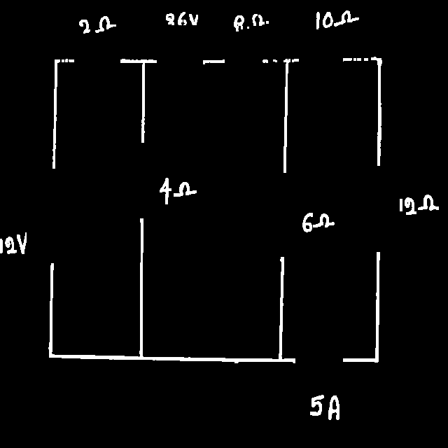

# Circuit Detection Application

Over the summer, I developed a system that can take a hand-drawn circuit diagram as input and automatically generate a valid SPICE netlist. The current implementation spans several Python scripts, and I am now working toward building a front-end interface with drag-and-drop functionality to make it easier to use.

This work was carried out entirely as a solo project, covering dataset creation, model training, and integration of computer vision and EDA concepts.

---

## Example workflow.

The following example illustrates the end-to-end process, from a raw hand-drawn circuit sketch to the extracted netlist.

  

  

**Workflow Breakdown:**

**1. Component Detection**
  - I trained a custom object detection model using

  

  

2. Cleaning of the image to 'remove' the circuits and using CV2 library using the coordinates generated from the model
   

  

  

3. Now the image is cleaned, there are still the values on but this doesnt matter, as this cleaned image is passed into an instance segmentor to gather a bitmap of bundles of wires which represent nodes at this point where we have deleted the components we can the find where the components attach to these nodes and build the Netlist
