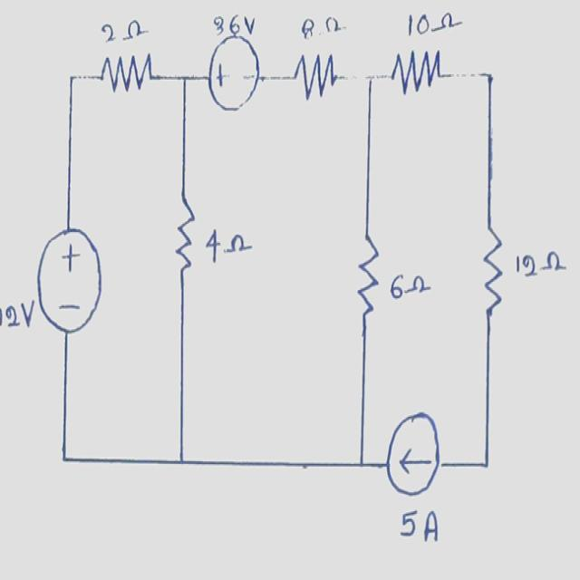

# Circuit Detection Application

Currently over several python scrpits I can decode an image of a hand drawn image and return a Spice NETLIST.

Ill use this example image to demonstrate the workflow.

**The workflow consists of:**
1. Detection of components using an object detection model I have trained using my own synthetic data then finetuned using real data.
2. Cleaning of the image to 'remove' the circuits and using CV2 library using the coords generated from the model
3. Shown picture of the cleaned image with now just "wires"
